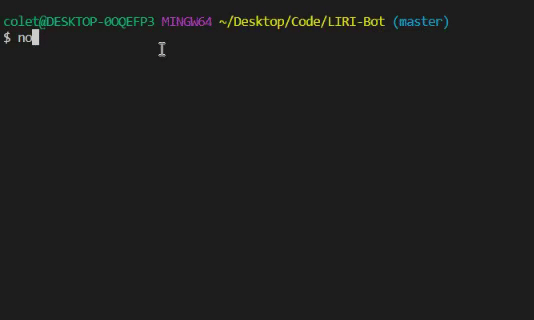

# LIRI-Bot



## Table of Contents

* [About the Project](#about-the-project)
* [Built With](#built-with)
* [Installation](#installation)
* [Usage](#usage)
* [Link to Clean Fridge](#link-to-clean-fridge)

## About The Project

LIRI Bot is a command line node app, that will take in command line arguments and return certain data based on which command you call. 


## Built With
* [Node.js](https://nodejs.org/en/)
* [Node-Spotify-API](https://www.npmjs.com/package/node-spotify-api)
* [Axios](https://www.npmjs.com/package/axios)
    * [OMDB API](http://www.omdbapi.com/)
    * [Bands In Town API](https://www.artists.bandsintown.com/bandsintown-api)
* [Moment](https://www.npmjs.com/package/moment)
* [DotEnv](https://www.npmjs.com/package/dotenv)


## Installation

1. You will need to get API Keys from the 3 API's mentioned above in order to use the LIRI Bot successfully
2. Clone the repo
```sh
git clone https://github.com/ColeMiller21/LIRI-Bot.git
```
3. Install NPM packages
```sh
npm install
```
4. Enter your Spotify API key in your own .env file 
```JS
SPOTIFY_ID = API Key

SPOTIFY_SECRET =  Secret Key
```

## Usage

After installing the necessary NPM packages you can type in one of 4 commands which are 

* [concert-this](#concert-this)
* [spotify-this-song](#spotify-this-song)
* [movie-this](#movie-this)
* [do-what-it-says](#do-what-it-says)
* [log.txt](#log.txt)


### concert-this

By typing in node liri.js concert-this <artist/band name here>

    - This will search the Bands in Town API for upcoming concerts by the artist returning

        - Name of the venue
        - Venue location
        - Date of the Event (use moment to format this as "MM/DD/YYYY")
        - The date of the Event will be formated by using the npm package moment.

### spotify-this-song

By typing in node liri.js spotify-this-song <song name here>

    - This will search the Spotify API for information of the song you have typed in returning

        - Artist(s)
        - The song's name
        - A preview link of the song from Spotify
        - The album that the song is from

### movie-this

By typing in node liri.js movie-this <movie name here>

    - This will search through the OMDB API for the movie information and return 

        - Title of the movie.
        - Year the movie came out.
        - IMDB Rating of the movie.
        - Rotten Tomatoes Rating of the movie.
        - Country where the movie was produced.
        - Language of the movie.
        - Plot of the movie.
        - Actors in the movie.

    - If you do not type anything in the movie "Mr. Nobody" will automatically be searched for

### do-what-it-says

By typing in node liri.js do-what-it-says

    - This will use the fs Node package to take the information typed in random.txt which is (spotify-this-song,"I Want it That Way") and search the run the same function for spotify-this-song and return the information. 

### log.txt

    - Each time you use the commands and get information back it will be appended to log.txt.


## Link To Clean Fridge

Project Link : [https://colemiller21.github.io/Clean-Fridge/](https://colemiller21.github.io/Clean-Fridge/)
